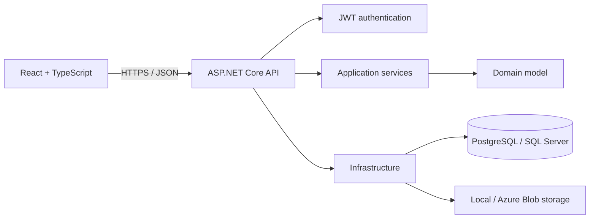

# Claims Management

[](https://github.com/hajarmrifag/claims-management-api/actions/workflows/ci.yml)
[](https://github.com/hajarmrifag/claims-management-api/actions/workflows/security.yml)
[](https://github.com/hajarmrifag/claims-management-api/actions/workflows/dast.yml)
[](https://claims-management-ync9.onrender.com)

A production-style full-stack application for submitting, reviewing, and auditing insurance claims. It pairs a responsive React and TypeScript interface with an ASP.NET Core API, role-based workflows, PostgreSQL persistence, automated tests, and a Docker deployment.

**[Open the live application](https://claims-management-ync9.onrender.com)**

> The free Render instance may need about 50 seconds to wake after inactivity. Create an account from the sign-in page; public registration safely assigns the `Adjuster` role.

## Why this project exists

Claims processing is more than CRUD: users need clear validation, predictable loading and error states, guarded routes, role-aware actions, auditable status transitions, and safe document handling. This project implements those concerns end to end rather than presenting disconnected screens.

## Product capabilities

- Register and sign in with JWT authentication
- Create a customer, policy, and claim through a guided workflow
- Search claims by status and date with server-side pagination
- Review claim details and status history
- Restrict status changes to `Manager` and `Admin` roles
- Upload and download PDF, JPEG, and PNG evidence up to 10 MB
- Handle loading, validation, empty, unauthorized, and API-error states
- Use the application across desktop and mobile layouts

## Engineering highlights

### Frontend

- React 19 and TypeScript with strict compilation
- React Router for public, protected, detail, and not-found routes
- TanStack Query for server state, caching, mutations, and request states
- React Hook Form and Zod for typed form validation
- Axios client with centralized authentication behavior
- Accessible labels, live status messages, error alerts, and keyboard-native controls
- ESLint, Vitest, and Testing Library checks in CI
- Playwright browser testing for the authentication-to-workspace journey

### Backend

- ASP.NET Core and C# with domain, application, infrastructure, and API layers
- Entity Framework Core with PostgreSQL in production and SQL Server support locally
- JWT authentication, password hashing, and role-based authorization
- Authentication endpoint rate limiting and browser defence-in-depth headers
- Auditable claim status workflow and duplicate-number protection
- Document size, type, filename, and magic-byte validation
- Storage abstraction supporting local files and Azure Blob Storage
- Central exception handling, structured request logging, and health checks
- xUnit unit tests and HTTP integration tests

### Delivery

- Multi-stage Docker build compiles the React client and .NET API into one image
- The production container runs as the built-in unprivileged .NET user
- Render Blueprint provisions the web service and PostgreSQL database
- GitHub Actions independently lint, test, and build frontend and backend
- CodeQL, Trivy, Dependabot, and OWASP ZAP provide automated security analysis
- Secrets are supplied through environment configuration and are not committed

## Application security case study

This repository includes a source-assisted security assessment rather than only
claiming that the application is "secure." The artifacts show how threats were
identified, classified, remediated, regression-tested, and carried into CI:

- [Threat model](docs/security/threat-model.md) - assets, trust boundaries,
  assumptions, and STRIDE abuse cases
- [Assessment report](docs/security/assessment-report.md) - severity, CWE and
  OWASP mappings, remediation, residual risk, and verification status
- [Security policy](SECURITY.md) - safe reporting expectations and project scope

The security workflows run CodeQL SAST, Trivy dependency/secret/configuration and
container scans, and an OWASP ZAP DAST baseline. Generated scan results remain in
GitHub's security view or workflow artifacts so the documentation does not invent
tool output that has not run.

## Architecture



TanStack Query owns remote state; authentication uses a small context backed by session storage. The API owns authorization and workflow rules—the UI improves usability but is never treated as a security boundary. See [engineering decisions](docs/engineering-decisions.md) for trade-offs and alternatives.

## API surface

| Method | Endpoint | Purpose |
|---|---|---|
| `POST` | `/api/auth/register` | Register an Adjuster |
| `POST` | `/api/auth/login` | Authenticate and receive a JWT |
| `POST` | `/api/customers` | Create a customer |
| `POST` | `/api/policies` | Create a policy |
| `POST` | `/api/claims` | Create a claim |
| `GET` | `/api/claims` | Filter and paginate claims |
| `GET` | `/api/claims/{id}` | Retrieve a claim and its history |
| `PATCH` | `/api/claims/{id}/status` | Make an authorized status transition |
| `POST` | `/api/claims/{id}/documents` | Upload claim evidence |
| `GET` | `/api/claims/{claimId}/documents/{documentId}` | Download evidence |

Business endpoints require a bearer token. Status changes additionally require the `Manager` or `Admin` role.

## Run locally

Requirements: Docker Desktop, .NET 10 SDK, and Node.js 24.

```bash
git clone https://github.com/hajarmrifag/claims-management-api.git
cd claims-management-api
./run.sh
```

Then open `http://localhost:5173`. The launcher starts SQL Server and both application processes.

Run the quality checks directly:

```bash
dotnet test
cd frontend
npm ci
npm run lint
npm test
npm run test:e2e
npm run build
```

## Security and operational boundaries

- Public registration cannot choose a privileged role.
- Passwords are hashed; credentials and JWT signing keys stay outside source control.
- Authorization is enforced by the API, including status-changing operations.
- Login and registration requests are rate limited per source address.
- Uploaded documents must match the declared PDF, JPEG, or PNG file signature.
- Production responses use HSTS and restrictive browser security headers.
- Search uses bounded pagination and no-tracking EF queries.
- The free demo stores uploaded file bytes on ephemeral container storage, so files may be lost after a restart. Production would use the existing Azure Blob provider or another durable object store.
- Render hosts the public portfolio deployment. The container could run on AWS, but this repository does not claim an AWS deployment that has not been implemented.

## Next improvements

- Expand Playwright coverage to claim creation, filtering, and documents
- Add durable object storage to the public deployment
- Add OpenTelemetry traces and production dashboards
- Express an AWS deployment as infrastructure as code
- Expand frontend tests around authentication, filters, and mutations

## What this demonstrates

This repository provides evidence of typed React development, API integration, form validation, server-state management, responsive product design, backend architecture, security-aware implementation, automated testing, containerization, CI, and cloud deployment. Its documentation makes the main technical decisions available for review and discussion.
