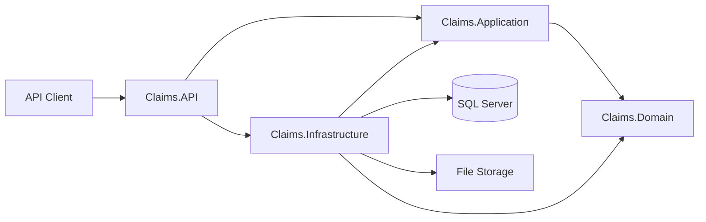

# Claims Management API

A production-style insurance claims backend built with **C#**, **ASP.NET Core**, **Entity Framework Core**, and **SQL Server**.

The project demonstrates enterprise backend engineering practices including layered architecture, JWT authentication, role-based authorization, auditable claim workflows, document handling, automated testing, structured logging, and CI with GitHub Actions.

## Architecture



The solution is split into four main layers:

- **Claims.Domain**: entities, enums, and domain behaviour
- **Claims.Application**: use cases, DTOs, interfaces, and application services
- **Claims.Infrastructure**: EF Core repositories, SQL Server persistence, password hashing, and file storage
- **Claims.API**: REST endpoints, JWT configuration, authorization, middleware, and dependency injection

Separate unit and integration test projects verify domain behaviour and end-to-end HTTP workflows.

## Features

### Claims

- Create insurance claims
- Retrieve claims by ID
- Search and filter claims
- Pagination
- Status workflow
- Claim status audit history
- Duplicate claim-number protection

Supported statuses:

- `Submitted`
- `UnderReview`
- `Approved`
- `Rejected`
- `Paid`

### Customers and Policies

- Customer creation
- Policy creation
- Unique customer email validation
- Unique policy-number validation
- Coverage information
- Customer-policy relationships

### Authentication and Authorization

- User registration
- Secure password hashing with Microsoft Identity
- JWT bearer authentication
- One-hour token expiration
- Role claims embedded in JWTs
- Protected business endpoints
- Role-based authorization

Roles:

- `Adjuster`
- `Manager`
- `Admin`

Public registration creates an `Adjuster` account by default.

Claim status changes require the `Manager` or `Admin` role.

### Claim Documents

Authenticated users can upload supporting documents for claims.

Accepted formats:

- PDF
- JPEG
- PNG

Uploads are limited to **10 MB**.

Document metadata is persisted with EF Core while physical storage is accessed through an `IFileStorage` abstraction.

The application supports both **local file storage** and **Azure Blob Storage** behind the same `IFileStorage` abstraction. The provider is selected through configuration, so the application layer remains unchanged.

Uploaded documents can also be downloaded through authenticated API endpoints.

### Validation and Error Handling

Request DTOs use DataAnnotations for validation.

Centralized exception handling covers:

- invalid requests
- authentication failures
- application conflicts
- unexpected server errors

### Structured Request Logging

Custom middleware records:

- HTTP method
- request path
- response status code
- elapsed request time
- trace identifier

## Technology Stack

- .NET 10
- C#
- ASP.NET Core Web API
- Entity Framework Core
- SQL Server
- JWT Bearer Authentication
- Microsoft Identity PasswordHasher
- xUnit
- ASP.NET Core integration testing
- EF Core InMemory provider
- Git
- GitHub Actions

## Database Model

The EF Core model includes:

- `Users`
- `Customers`
- `Policies`
- `Claims`
- `ClaimDocuments`
- `ClaimStatusHistories`

The persistence layer uses:

- foreign-key relationships
- unique indexes
- decimal precision configuration
- enum-to-string conversion
- cascade/restrict delete behaviour
- query-oriented indexes
- EF Core migrations

## Database Performance

The claim search path is designed with SQL Server query performance in mind.

Implemented optimizations include:

- `AsNoTracking()` for read-only claim searches
- server-side status and date filtering
- asynchronous EF Core queries
- bounded pagination with `Skip` and `Take`
- a unique index on `ClaimNumber`
- a composite index on `(Status, SubmittedAt)`
- a separate index on `SubmittedAt` for date-ordered searches without a status filter
- indexes supporting foreign-key lookups

The generated SQL migration script has been reviewed to verify that these indexes and bounded SQL Server column types are actually produced by EF Core.

No latency or throughput numbers are claimed yet because the project has not been benchmarked against a live SQL Server instance. Real execution-plan and timing measurements can be added after deployment.

## API Endpoints

| Method | Endpoint | Description |
|---|---|---|
| POST | `/api/auth/register` | Register an Adjuster |
| POST | `/api/auth/login` | Authenticate and receive a JWT |
| POST | `/api/customers` | Create a customer |
| POST | `/api/policies` | Create a policy |
| POST | `/api/claims` | Create a claim |
| GET | `/api/claims/{id}` | Retrieve a claim |
| GET | `/api/claims` | Search and paginate claims |
| PATCH | `/api/claims/{id}/status` | Update claim status |
| POST | `/api/claims/{id}/documents` | Upload a claim document |
| GET | `/api/claims/{claimId}/documents/{documentId}` | Download a claim document |

Business endpoints require JWT authentication.

## Testing

The repository contains both unit and integration tests.

Unit tests cover domain behaviour such as claim creation and status changes.

Integration tests cover complete HTTP workflows including:

- user registration and login
- JWT generation
- customer creation
- customer → policy → claim workflow
- authorization rules
- document upload and download

Run all tests with:

```bash
dotnet test
```

## Continuous Integration

GitHub Actions runs automatically on pushes and pull requests to `main`.

The CI pipeline:

1. checks out the repository
2. installs .NET 10
3. restores dependencies
4. builds in Release mode
5. runs the complete automated test suite

## Running Locally

Clone the repository:

```bash
git clone https://github.com/hajarmrifag/claims-management-api.git
cd claims-management-api
```

Configure the SQL Server connection using .NET User Secrets:

```bash
dotnet user-secrets set \
  "ConnectionStrings:ClaimsDatabase" \
  "<YOUR_SQL_SERVER_CONNECTION_STRING>" \
  --project src/Claims.API
```

Configure the JWT signing key:

```bash
dotnet user-secrets set \
  "Jwt:Key" \
  "<YOUR_SECURE_SIGNING_KEY>" \
  --project src/Claims.API
```

Apply EF Core migrations:

```bash
dotnet ef database update \
  --project src/Claims.Infrastructure \
  --startup-project src/Claims.API
```

Run the API:

```bash
dotnet run --project src/Claims.API
```

## Security Design

Database credentials and JWT signing secrets are not committed to source control.

Local secrets are stored with **.NET User Secrets**.

Public registration does not allow clients to assign themselves privileged roles.

Passwords are stored as secure hashes rather than plaintext.

Protected endpoints use JWT bearer authentication and role-based authorization.

## Engineering Goals

This project is intentionally more than a CRUD demo.

It demonstrates:

- separation of concerns
- dependency inversion
- clean project boundaries
- repository abstraction
- secure authentication
- role-based access control
- auditable domain workflows
- file-storage abstraction
- automated testing
- centralized error handling
- request observability
- CI automation
- cloud-ready infrastructure boundaries

## Planned Improvements

- Azure SQL deployment
- API deployment to Azure
- database performance benchmarking
- richer OpenAPI documentation
- expanded authorization policies
