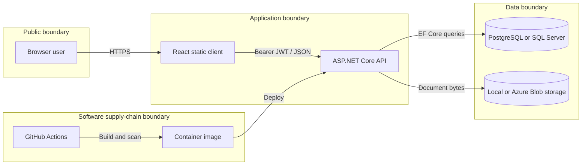

# Threat model

Last reviewed: 14 September 2026

## Scope and security objective

The system is a portfolio implementation of an internal insurance claims
workspace. Its primary security objective is to ensure that only authenticated
staff can access claims data and that only Manager or Admin users can change a
claim's status. It uses synthetic demonstration data and is not approved for
real personal, financial, medical, or insurance information.

The current authorization model assumes one trusted organization: authenticated
Adjusters can see the shared claims queue. Customer-facing access, multi-tenancy,
and per-adjuster claim ownership are explicitly outside the present scope. Those
features would require resource-level authorization before launch.

## Assets

- user credentials and password hashes
- JWT signing material and issued access tokens
- customer, policy, claim, and status-history records
- uploaded claim evidence
- database and object-storage credentials
- audit and request logs
- source code, build workflows, and deployment configuration

## Actors

- unauthenticated visitor
- authenticated Adjuster
- privileged Manager or Admin
- application operator
- external attacker
- compromised dependency or CI workflow

## Data flow and trust boundaries

Trust boundaries exist between the browser and API, API and persistence
providers, CI and third-party actions, and the deployed application and its
environment-provided secrets.

## STRIDE analysis

| ID | Category | Threat | Existing controls | Residual risk / next step |
|---|---|---|---|---|
| TM-01 | Spoofing | Credential guessing or token forgery | Password hashing, signed JWTs, issuer/audience/lifetime validation, authentication rate limit | Add account lockout and monitoring if accounts become persistent |
| TM-02 | Tampering | Adjuster changes a claim to an unauthorized state | API-side role authorization and domain transition rules | Add explicit negative tests for every privileged transition |
| TM-03 | Repudiation | A privileged user denies changing claim status | Append-only status history and structured request logging | Record authenticated subject and security-relevant events in a durable audit sink |
| TM-04 | Information disclosure | Token theft through browser script execution | Short-lived token and restrictive CSP | Replace session storage with secure HttpOnly cookies plus CSRF controls before production use |
| TM-05 | Information disclosure | One staff user reads a claim outside their permitted scope | Shared-workspace scope is documented; document IDs are checked against claim IDs | Add tenant and resource ownership policies before introducing customers or multiple organizations |
| TM-06 | Denial of service | Oversized uploads or repeated authentication attempts consume resources | 10 MB request limit and fixed-window auth rate limit | Add global/API quotas and platform-level traffic controls |
| TM-07 | Elevation of privilege | Public registrant selects Manager or Admin | Registration assigns Adjuster server-side; privileged status endpoint checks roles | Add an operator-controlled role-management workflow with strong audit logging if needed |
| TM-08 | Tampering | Executable content is disguised as a permitted document | Allowlist, size limit, filename normalization, and magic-byte validation | Add malware scanning and content reconstruction for real documents |
| TM-09 | Supply chain | Vulnerable dependency or compromised artifact reaches deployment | Lockfiles, CI builds, Dependabot, CodeQL, Trivy, and an unprivileged runtime container | Pin third-party actions to immutable commit SHAs and review alerts before release |
| TM-10 | Information disclosure | Secrets are committed or logged | Environment configuration, generic 500 errors, and Trivy secret scanning | Add platform secret scanning and rotate any exposed credential immediately |

## Security assumptions

- TLS terminates at the hosting platform for the public deployment.
- Secrets are injected through environment configuration and are never committed.
- Demonstration users and data are disposable.
- The local storage provider is for development only; durable production storage
  would require private containers, encryption, retention rules, and malware
  scanning.
- External security tests must remain non-destructive and within the environment
  owner's authorization.

## Review triggers

Review this model when authentication changes, a new role or endpoint is added,
the data becomes non-synthetic, a new storage provider is introduced, or CI and
deployment trust relationships change.
